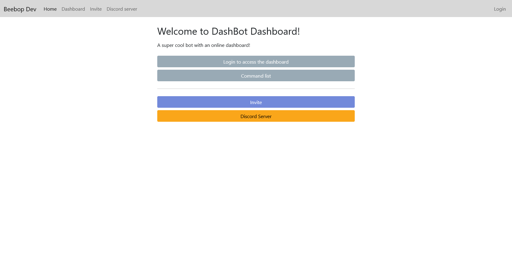
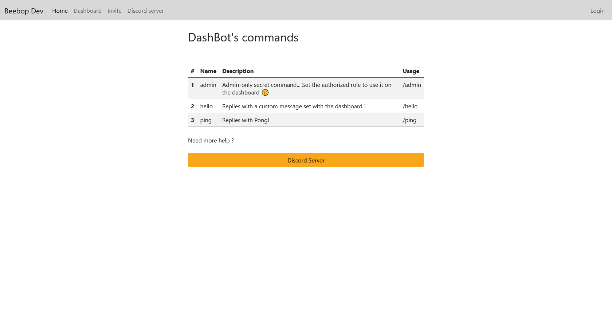
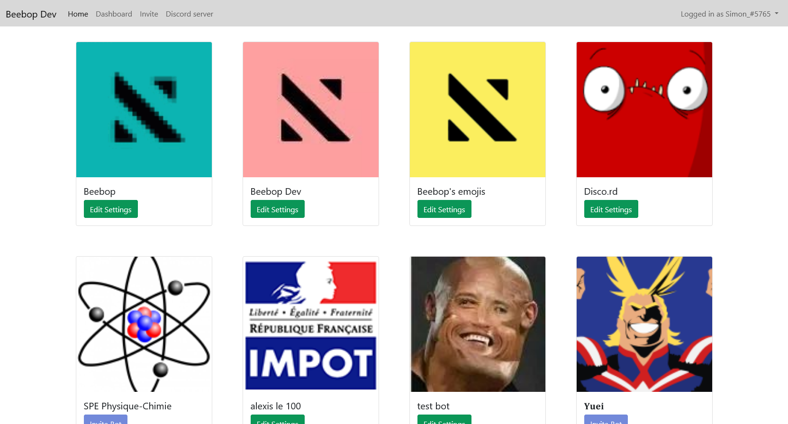
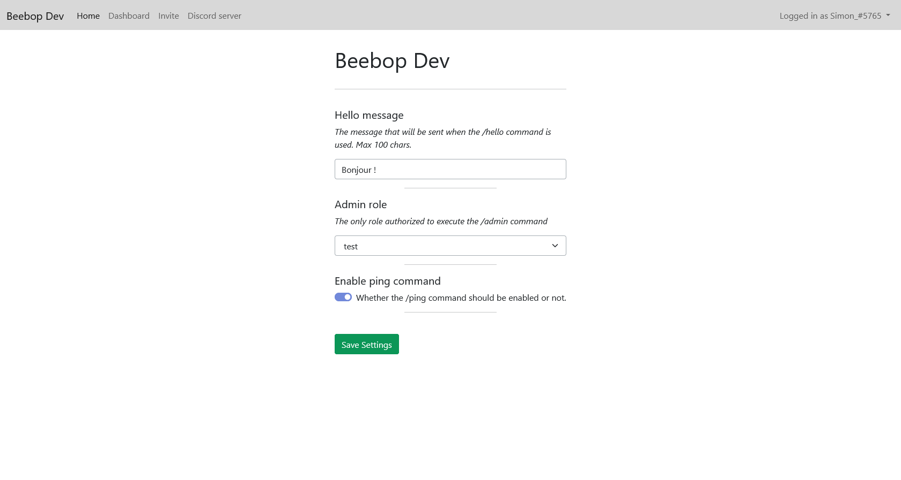

# Dashbot

Example of use of the [`discord-easy-dashboard`](https://github.com/SimonLeclere/discord-easy-dashboard) module.

## How to install

```
git clone https://github.com/SimonLeclere/dashbot
npm i
```
Fill the config.json file and then :
```
node .\deploy-commands.js
node .
```
And that's it ! Ready to go !

Tip : The `secret_client` is on your [discord developers](https://discord.com/developers/applications) page in the OAuth2 section!

## Screenshots




